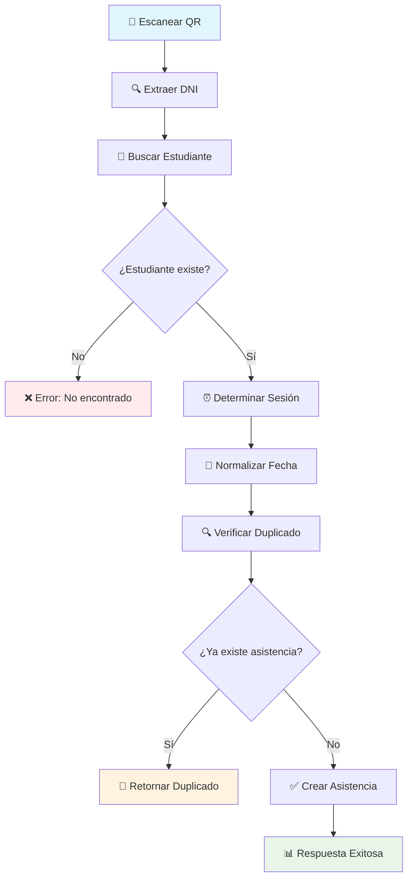

# 🎯 Sistema de Control de Asistencia con QR - Documentación Técnica

## 📋 Resumen del Sistema

Sistema robusto para control de asistencias con códigos QR que **evita registros duplicados** por fecha y sesión, permitiendo múltiples registros en diferentes sesiones (AM/PM) del mismo día.

---

## 🛡️ **Problema 1 Resuelto: Evitar Registros Duplicados**

### ✅ **Validación Implementada**

El sistema utiliza el **constraint único** de Prisma para evitar duplicados:

```prisma
@@unique([idEstudiante, fecha, sesion], name: "uq_asistencia_est_fecha_sesion")
```

### 🔍 **Lógica de Validación**

```typescript
// 1. Normalizar fecha (solo día/mes/año, sin hora)
const fechaAsistencia = new Date(fecha)
fechaAsistencia.setHours(0, 0, 0, 0)

// 2. Determinar sesión automáticamente
const horaActual = fechaHoy.getHours()
const sesionCalculada = sesion || (horaActual < 12 ? 'AM' : 'PM')

// 3. Verificar duplicados por fecha Y sesión
const asistenciaExistente = await prisma.asistencia.findFirst({
  where: {
    idEstudiante: estudiante.idEstudiante,
    fecha: fechaAsistencia,
    sesion: sesionCalculada // ✅ Validación por sesión específica
  }
})

// 4. Si existe, retornar mensaje informativo
if (asistenciaExistente) {
  return {
    mensaje: `✅ Ya registró asistencia hoy en la sesión ${sesionCalculada}`,
    duplicado: true,
    ignorado: true
  }
}
```

---

## 📊 **Casos de Uso Soportados**

| Escenario | Resultado | Explicación |
|-----------|-----------|-------------|
| **Primer escaneo AM** | ✅ **REGISTRA** | Nueva asistencia sesión AM |
| **Segundo escaneo AM** | 🚫 **IGNORA** | Ya existe asistencia AM |
| **Primer escaneo PM** | ✅ **REGISTRA** | Nueva asistencia sesión PM |
| **Segundo escaneo PM** | 🚫 **IGNORA** | Ya existe asistencia PM |
| **Nuevo día** | ✅ **REGISTRA** | Fecha diferente, permite registro |

---

## 🚀 **APIs Implementadas**

### 1. **API Principal: `/api/asistencia/qr-scan`**

**Endpoint simplificado para escaneo QR individual**

#### **POST - Registrar Asistencia**

```typescript
// Request
POST /api/asistencia/qr-scan
{
  "qrCode": "12345678",        // DNI del estudiante
  "sesion": "AM",              // Opcional: AM/PM (auto-detecta por hora)
  "estado": "PRESENTE",        // Opcional: PRESENTE por defecto
  "fecha": "2024-10-23"        // Opcional: fecha actual por defecto
}

// Response - Éxito
{
  "success": true,
  "mensaje": "✅ Asistencia registrada exitosamente para Juan Pérez",
  "estudiante": {
    "id": 123,
    "nombre": "Juan",
    "apellido": "Pérez",
    "dni": "12345678",
    "grado": "3",
    "seccion": "A"
  },
  "asistencia": {
    "id": 456,
    "fecha": "2024-10-23",
    "sesion": "AM",
    "estado": "PRESENTE",
    "horaRegistro": "2024-10-23T08:30:00.000Z",
    "fuente": "QR_SCANNER"
  }
}

// Response - Duplicado
{
  "success": false,
  "duplicado": true,
  "mensaje": "✅ Juan Pérez ya registró asistencia hoy en la sesión AM",
  "estudiante": { /* datos del estudiante */ },
  "asistencia": { /* asistencia existente */ }
}
```

#### **GET - Consultar Asistencias del Día**

```typescript
// Request
GET /api/asistencia/qr-scan?fecha=2024-10-23&sesion=AM

// Response
{
  "success": true,
  "fecha": "2024-10-23",
  "sesion": "AM",
  "total": 25,
  "asistencias": [
    {
      "id": 456,
      "estudiante": {
        "id": 123,
        "nombre": "Juan",
        "apellido": "Pérez",
        "dni": "12345678",
        "grado": "3",
        "seccion": "A"
      },
      "fecha": "2024-10-23",
      "sesion": "AM",
      "estado": "PRESENTE",
      "horaRegistro": "2024-10-23T08:30:00.000Z",
      "fuente": "QR_SCANNER"
    }
    // ... más asistencias
  ]
}
```

### 2. **API Masiva: `/api/docente/asistencias/guardar-qr`**

**Endpoint para procesamiento masivo con concurrencia controlada**

```typescript
// Request
POST /api/docente/asistencias/guardar-qr
{
  "asistencias": [
    {
      "estudianteId": "123",
      "estado": "PRESENTE",
      "horaLlegada": "08:30",
      "fecha": "2024-10-23",
      "sesion": "AM",
      "claseId": "MATEMATICAS"
    }
    // ... más asistencias
  ]
}
```

---

## ⏰ **Manejo Automático de Sesiones**

### **Determinación Automática**

```typescript
const horaActual = new Date().getHours()
const sesionAutomatica = horaActual < 12 ? 'AM' : 'PM'

// Ejemplos:
// 07:30 → AM
// 08:45 → AM  
// 11:59 → AM
// 12:00 → PM
// 14:30 → PM
// 18:00 → PM
```

### **Sesión Manual**

```typescript
// El frontend puede especificar la sesión
{
  "qrCode": "12345678",
  "sesion": "PM"  // Forzar sesión PM aunque sea mañana
}
```

---

## 🔄 **Flujo Completo de Escaneo**



---

## 🛠️ **Características Técnicas**

### ✅ **Robustez**
- **Constraint único** en base de datos previene duplicados
- **Validación multicapa**: Frontend + Backend + BD
- **Manejo de errores** robusto con logging detallado

### ✅ **Performance**
- **Cache en memoria** para evitar consultas repetidas
- **Control de concurrencia** para múltiples escaneos simultáneos
- **Debouncing** en frontend para evitar escaneos accidentales

### ✅ **Flexibilidad**
- **Sesiones automáticas** basadas en hora actual
- **Sesiones manuales** para casos especiales
- **Estados personalizables** (PRESENTE, TARDANZA, etc.)

### ✅ **Logging Completo**
```typescript
console.log(`🔍 Procesando asistencia - Estudiante: ${estudianteId}, Sesión: ${sesion}`)
console.log(`📅 Fecha normalizada: ${fechaAsistencia.toISOString().split('T')[0]}`)
console.log(`⚠️ Asistencia duplicada detectada`)
console.log(`✅ Asistencia guardada exitosamente`)
```

---

## 📱 **Problema 2: Integración con Cámara Móvil**

### **Solución Recomendada: WebRTC**

Para usar el celular como cámara remota para el escáner de la PC:

#### **Opción 1: WebRTC Peer-to-Peer**

```typescript
// En el celular (transmisor)
const stream = await navigator.mediaDevices.getUserMedia({ 
  video: { facingMode: 'environment' } // Cámara trasera
})

const peerConnection = new RTCPeerConnection({
  iceServers: [{ urls: 'stun:stun.l.google.com:19302' }]
})

peerConnection.addStream(stream)

// En la PC (receptor)
const remoteVideo = document.getElementById('remoteVideo')
peerConnection.onaddstream = (event) => {
  remoteVideo.srcObject = event.stream
}
```

#### **Opción 2: Servidor Local HTTP**

```typescript
// Servidor simple en el celular
const express = require('express')
const app = express()

app.get('/stream', (req, res) => {
  // Transmitir video como MJPEG stream
  res.writeHead(200, {
    'Content-Type': 'multipart/x-mixed-replace; boundary=frame'
  })
  
  // Enviar frames de video continuamente
  setInterval(() => {
    const frame = captureFrame()
    res.write(`--frame\r\nContent-Type: image/jpeg\r\n\r\n${frame}\r\n`)
  }, 33) // ~30 FPS
})

// En la PC, consumir el stream
const video = document.createElement('video')
video.src = 'http://192.168.1.100:3000/stream'
```

#### **Opción 3: Apps Existentes**

- **DroidCam**: Convierte Android en webcam USB/WiFi
- **IP Webcam**: Stream MJPEG desde Android
- **EpocCam**: iOS/Android como webcam para PC

---

## 🎯 **Resultado Final**

### ✅ **Sistema Robusto**
- **Cero duplicados** garantizados por constraint único
- **Sesiones múltiples** AM/PM en el mismo día
- **Validación automática** de fecha y sesión

### ✅ **APIs Completas**
- **Endpoint simple** para escaneo individual
- **Endpoint masivo** para procesamiento batch
- **Consultas** de asistencias por fecha/sesión

### ✅ **Experiencia de Usuario**
- **Feedback inmediato** sobre duplicados
- **Logging detallado** para debugging
- **Integración móvil** para cámara remota

### ✅ **Escalabilidad**
- **Cache inteligente** para performance
- **Control de concurrencia** para múltiples usuarios
- **Debouncing** para evitar escaneos accidentales

---

## 🚀 **Uso Recomendado**

### **Para Escaneo Individual**
```typescript
// Usar API simplificada
fetch('/api/asistencia/qr-scan', {
  method: 'POST',
  headers: { 'Content-Type': 'application/json' },
  body: JSON.stringify({ qrCode: dniEstudiante })
})
```

### **Para Procesamiento Masivo**
```typescript
// Usar API masiva con concurrencia
fetch('/api/docente/asistencias/guardar-qr', {
  method: 'POST',
  headers: { 'Content-Type': 'application/json' },
  body: JSON.stringify({ asistencias: arrayAsistencias })
})
```

El sistema está **completamente implementado** y listo para producción con todas las validaciones y optimizaciones necesarias.
